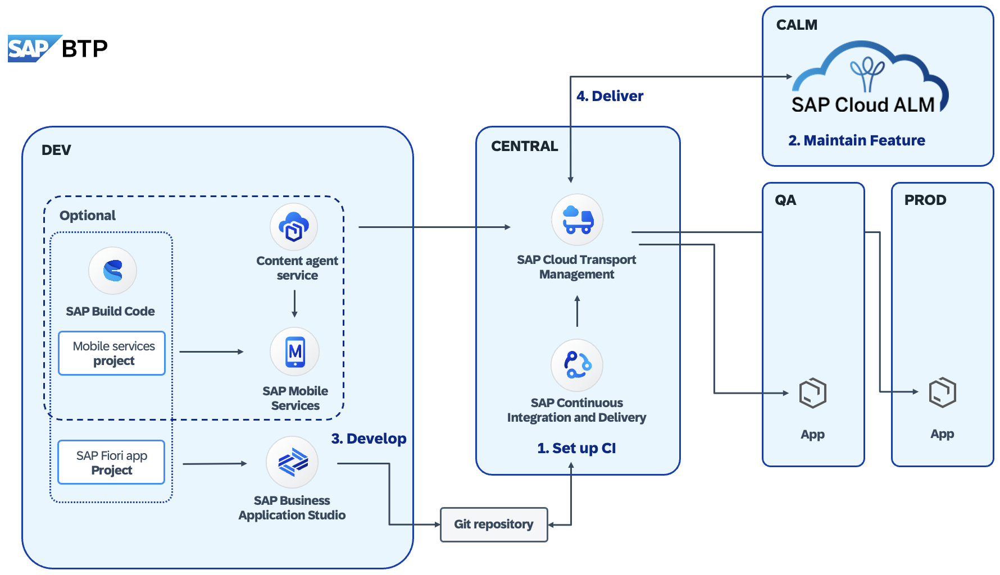

# XP266 - Experience how to govern the delivery of content in SAP Build solutions

## Description

This repository contains the material for the SAP TechEd 2025 session called XP266 - Experience how to govern the delivery of content in SAP Build solutions.  

## Overview

Learn how to deliver content on SAP BTP in enterprise environments across staged DEV, TEST, and PROD landscapes—through the example of transporting development changes in SAP Build solutions. Gain hands-on experience with the interplay of SAP Content Agent service, SAP Cloud Transport Management service, and the SAP Cloud ALM solution.

## **Main scenario covered during this session:**
Within this hands-on tutorial, we will cover:

1. Set up your delivery pipeline and transport landscape
2. Maintain your feature in Cloud ALM
3. Implement your development changes and initiate the creation of a transport
4. Manage your feature in Cloud ALM: assign transports and deploy your changes to your QA and PROD environments

## Prerequisites

To complete the exercises in this repository, please make sure that you meet the following prerequisites:

* You have an account on [GitHub](https://github.com/signup).
* You have an [SAP Business Technology Platform (BTP) Account](https://developers.sap.com/tutorials/hcp-create-trial-account.html).

## Exercises

* #### [Exercise 0 - Preparation Steps](exercises/ex0#exercice-0---preparation-steps)

  * [Exercise 0.0 - (Optional) Create a GitHub account](exercises/ex0#exercise-00---optional-create-a-github-account)
  * [Exercise 0.1 - Create a Copy of This Repository](exercises/ex0#exercicse-01---create-a-copy-of-this-repository)
  * [Exercise 0.2 - Login to your BTP subaccount](exercises/ex0#exercise-02---login-to-your-btp-subaccount)

* #### [Exercise 1 - Set up your Delivery Pipeline and Transport Landscape](exercises/ex1#exercise-1---set-up-your-delivery-pipeline-and-transport-landscape)
  * [Exercise 1.0 - Open the Continuous Integration and Delivery Service](exercises/ex1#exercise-10---open-the-continuous-integration-and-delivery-service)
  * [Exercise 1.1 - Add Your Repository in SAP CI CD Service](exercises/ex1#exercise-11---add-your-repository-in-sap-ci-cd-service)
  * [Exercise 1.2 - Create a Webhook](exercises/ex1#exercise-12---create-a-webhook)
  * [Exercise 1.3 - Create a Pipeline Job](exercises/ex1#exercise-13---create-a-pipeline-job)
  * [Exercise 1.4 - Configure the Release Stage](exercises/ex1#exercise-14---configure-the-release-stage)
  * [Exercise 1.5 - Create Transport Landscape in SAP Cloud Transport Management Service](exercises/ex1#exercise-15---create-transport-landscape-in-sap-cloud-transport-management-service)

* #### [Exercise 2 - Maintain your Feature in Cloud ALM](exercises/ex2#Exercise-2---Maintain-your-Feature-in-Cloud-ALM)
  * [Exercise 2.0 - Check your Cloud ALM and cTMS configuration](exercises/ex2#exercise-20---check-your-cloud-alm-and-ctms-configuration)
  * [Exercice 2.1 - Create a new Feature](exercises/ex2#exercise-21---create-a-new-feature)

* #### [Exercise 3 - Create a Transport of your pro-code Application](exercises/ex3#create-a-transport-of-your-pro-code-application)
  * [Exercise 3.0 - Create a new Development Project in SAP Build](exercises/ex3#exercise-30---create-a-new-development-project-in-sap-build)
  * [Exercise 3.1 - Add additional sample data to your application](exercises/ex3#exercise-31---add-additional-sample-data-to-your-application)
  * [Exercise 3.2 - Release your Changes to GitHub](exercises/ex3#exercise-32---release-your-changes-to-github)

* #### [Exercise 4 - Create a Transport of your low-code Application (Optional)](exercises/ex4#create-a-transport-of-your-low-code-application-optional)
  * [Exercise 4.0 - Create a new SAP Build Mobile Project in SAP Build](exercises/ex4#exercise-40---create-a-ne-sap-build-mobile-project-in-sap-build)
  * [Exercise 4.1 - Access Mobile Services and add a new Feature](exercises/ex4#exercise-41---access-mobile-services-and-add-a-new-feature)
  * [Exercise 4.2 - Setup SAP Content Agent Service](exercises/ex4#exercise-42---setup-sap-content-agent-service)
  * [Exercise 4.3 - Create and export a Transport Request in SAP Content Agent Service UI](exercises/ex4#exercise-43---create-and-export-a-transport-request-in-sap-content-agent-service)

* #### [Exercise 5 - Verify all Release Steps](exercises/ex5#verify-all-release-steps)
  * [Exercise 5.0 - Check the Pipeline Job Status](exercises/ex5#exercise-50---check-the-pipeline-job-status)
  * [Exercise 5.1 - Verify Transports created in SAP Cloud Transport Management](exercises/ex5#exercise-51---verify-transports-created-in-sap-cloud-transport-management)

* #### [Exercise 6 - Manage your Feature in Cloud ALM & Deployment](exercises/ex6#exercise-6---manage-your-feature-in-cloud-alm--deployment)
  * [Exercise 6.0 - Manage the lifefcylce of your feature](exercises/ex6#exercise-60---manage-the-lifefcylce-of-your-feature)
  * [Exercise 6.1 - Deploy and monitor changes in your QA and Prod environment](exercises/ex6#exercise-61---deploy-and-monitor-changes-in-your-qa-and-prod-environment)
  * [Exersice 6.2 - Find and access the deployed applications](exercises/ex6#exersice-62---find-and-access-the-deployed-applications)

## Contributing
Please read the [CONTRIBUTING.md](./CONTRIBUTING.md) to understand the contribution guidelines.

## Code of Conduct
Please read the [SAP Open Source Code of Conduct](https://github.com/SAP-samples/.github/blob/main/CODE_OF_CONDUCT.md).

## How to obtain support

Support for the content in this repository is available during the actual time of the online session for which this content has been designed. Otherwise, you may request support via the [Issues](../../issues) tab.

## License
Copyright (c) 2025 SAP SE or an SAP affiliate company. All rights reserved. This project is licensed under the Apache Software License, version 2.0 except as noted otherwise in the [LICENSE](LICENSES/Apache-2.0.txt) file.
