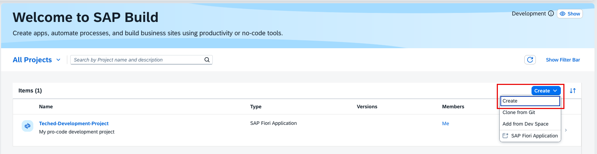
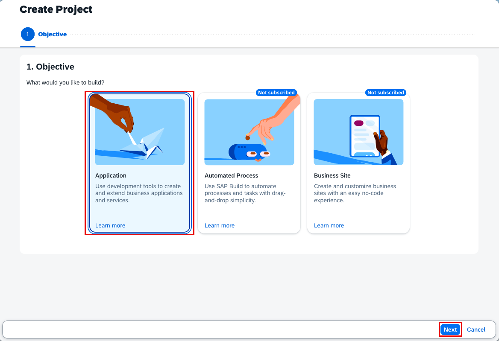
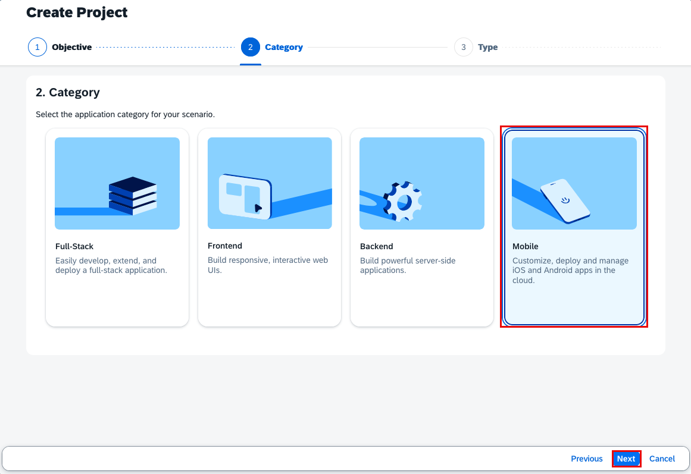
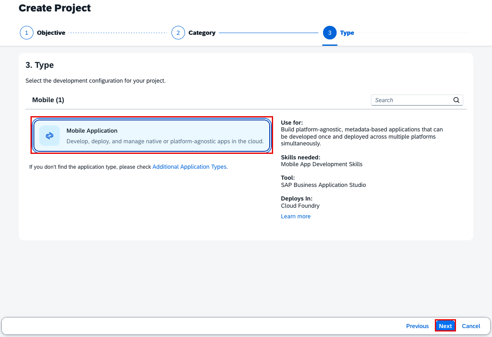
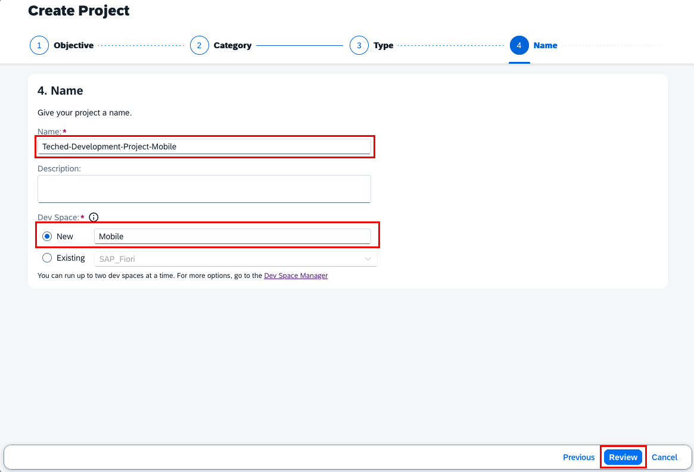
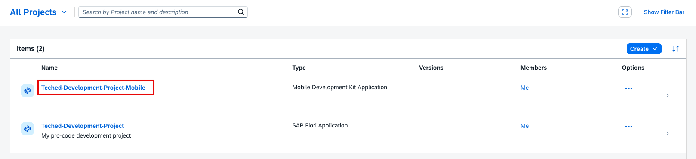
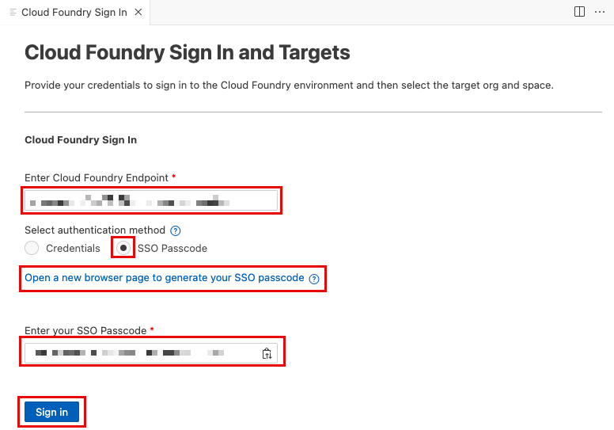
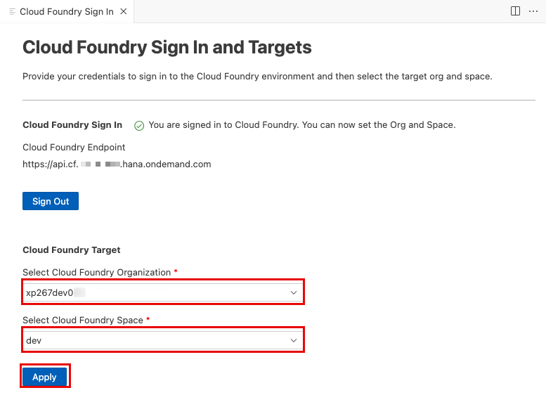
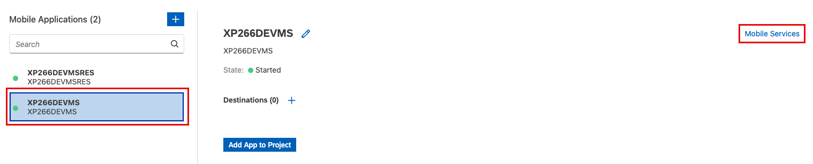

# Transport your low-code application

In this exercise, you will create a new transport request using **SAP Content Agent Service** and **SAP Build** together with **SAP Mobile Services**.

## Exercise 4.0 - Create a new SAP Build Mobile Project

1. In SAP BTP cockpit, navigate to your development SAP BTP subaccount named `XP266_DEV`. 
2. Go to **Services** > **Instances and Subscription** and open **SAP Build Code** in the Subscriptions area.
         
3. The SAP Build Lobby will open. To establish a new development project, click on **Create** > **Clone from Git**.
         
4. In Create project popup, set the objective as **Application**, and click **Next**.
         
5. Choose **Mobile** and confirm with **Next**.
         
6. As type choose **Mobile Application** and click **Next** again.
         
7. Finally choose a name e.g. **Teched-Development-Project-Mobile**, optionally a description and leave the Dev Space as **Mobile**.
         
8. Confirm with **Review** and **Create**.
9. Your project of Type **Mobile Development Kit Application** will now be be created. Once the creation is done, click the project name to open the **Business Application Studio**.
         

## Exercise 4.1 - Access Mobile Services and add a new Feature

In the previous you have opened your **Mobile Development Kit Application** project in **Business Application Studio**.

1. In the **Business Application Studio** Storyboard, click on **Add a new Mobile Services app**.
         
2. Sign to Cloud Foundry environment, generate a new **SSO passcode** and copy it to the corresponding input field. Confirm with **Sign In**.
         
3. Select the target **org** **xp266dev** and **space** **dev** and click **Apply**.
         
4. A new **Mobile Application tab** opens with the two sample Mobile Applications visible.
5. Choose **XP266DEVMS** and click **Mobile Services** to open the app.
         
6. You can now apply a simple change to the application (Steps 7. - 10. are optional)
7. On the bottom right, click on **Add Feature**.
         
8. In the popup choose any feature from the list e.g. ``Push Notifications`` and confirm with **OK**.
         
9.  **Save** the feature.
         
10. The new feature will appear as a new **Add-On Features** tile in the application.
         

In the next step, you will bundle this application in a new transport request using **SAP Content Agent Service** UI.

## Exercise 4.2 - Setup SAP Content Agent Service

1. In SAP BTP cockpit, navigate to your development SAP BTP subaccount named `XP266_DEV`.
2. Go to **Services** > **Instances and Subscription** and open **Content Agent Service** in the Subscriptions area to access the UI.
         
3. Once Content Agent Service Overview page open, navigate to **Cloud Transport Management** in the side panel.
4. In the drop-down, choose **TransportManagementService** as Destination and click **Refresh Connection**. The status should be **Connected**.
 

## Exercise 4.3 - Create and export a Transport Request in SAP Content Agent Service UI

In SAP Content Agent Service, you will now prepare a transport request containing development content provided by the SAP Mobile Services SDK.

1. In SAP Content Agent Service UI, go to **Export**.
         
2. Select ``XP266DEVMS`` and ``XP266DEVMSRES`` of Type Mobile application.
         
3. Go to **Step 2**
4. As Export Mode leave SAP Cloud Transport Management
5. Choose ``DEV`` as your Source Node.
6. Enter a description e.g. ``My low-code application``
7. Continue with **Step 3** and  **Step 4** to trigger **export** to SAP Cloud Transport Management Service.
         

## Summary

You've now created a transport request via SAP Content Agent Service by bundling low-code development content provided by SAP Build and SAP Mobile Services.

In the next exercise you will verify the creation for two transport requests. One that has been created in this exercise 3 and one that has been created in the previous exercise 4.

Continue to - [Verify all Release Steps](../ex5/README.md)
